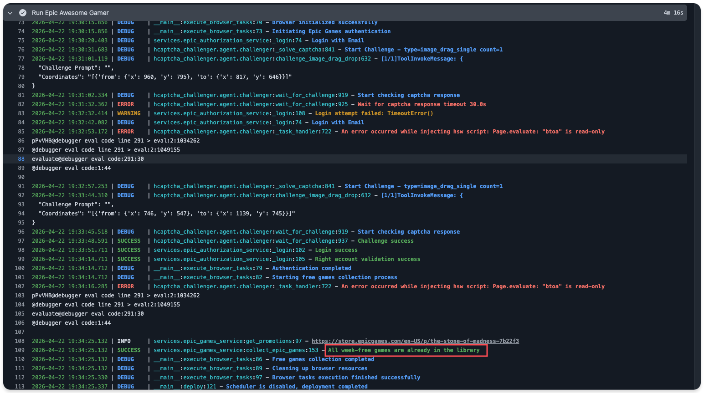

# Epic Weekly Free Games Helper

<p>
  <a href="https://github.com/Ronchy2000/epic-freebies-helper/actions/workflows/epic-gamer.yml"></a>
  <a href="https://www.python.org/"></a>
  <a href="LICENSE"></a>
  <a href="https://github.com/Ronchy2000/epic-freebies-helper/stargazers"></a>
  <a href="https://visitor-badge.laobi.icu/badge?page_id=Ronchy2000.epic-freebies-helper"></a>
</p>

[中文文档](README.md) | [English](README.en.md)

## Project Description

This project runs an Epic weekly free-games claiming flow on GitHub Actions.

The default runtime is GitHub Actions. No server or long-running local machine is required.

The workflow includes:

| Function | Description |
| --- | --- |
| Epic account login | Signs in with the configured Epic email and password |
| Weekly free-game discovery | Reads currently claimable Epic free games |
| Captcha handling | Calls the configured multimodal model for login or checkout captchas |
| Claim flow | Opens product pages and executes the claim flow |
| Scheduled execution | Runs on a GitHub Actions schedule by default |

## Before You Start

Confirm the following items before configuration:

| Item | Requirement |
| --- | --- |
| Epic account | An Epic account that can sign in normally |
| Epic 2FA | Email, SMS, and authenticator two-factor authentication must be disabled |
| GitHub account | Required to fork the repository and run GitHub Actions |
| Model endpoint | At least one image-capable model provider must be configured |
| API key | Configure the API key for the selected provider |

## Risk Notice

> [!WARNING]
> This project automatically performs Epic login, captcha handling, and claim actions.
>
> Before use, verify whether this type of automation complies with the relevant platform terms.
>
> Account risk control, login anomalies, claim failures, API costs, credential leakage, and other consequences are the user's responsibility.

## Quick Start

### 1. Fork the Repository and Enable Actions

> [!TIP]
> If you have already forked this repository, open your fork and click `Sync fork` -> `Update branch`
> before continuing.

1. Fork this repository to your GitHub account.
2. Open the `Actions` page in your fork.
3. Enable the workflow named `Epic Awesome Gamer (Scheduled)`.

### 2. Configure Secrets

Open `Settings` -> `Secrets and variables` -> `Actions`, then add the following Secrets.

#### Required Secrets

| Secret | Description | Example |
| --- | --- | --- |
| `EPIC_EMAIL` | Epic login email | `your_email@example.com` |
| `EPIC_PASSWORD` | Epic login password | `your_password` |
| `LLM_PROVIDER` | Model provider | `glm` |

The current DeepSeek V4 branch supports `glm`, `deepseek`, and `gemini` for `LLM_PROVIDER`.

OpenAI / GPT configuration is kept in [Provider Configuration](docs/providers.md). Use
`LLM_PROVIDER=openai` only when the code includes the OpenAI provider.

#### Provider Configuration

Select one group according to `LLM_PROVIDER`.

| Provider | Secret | Recommended value | Description |
| --- | --- | --- | --- |
| `glm` | `GLM_API_KEY` | - | Zhipu API key |
| `glm` | `GLM_BASE_URL` | `https://open.bigmodel.cn/api/paas/v4` | Zhipu OpenAI-compatible endpoint |
| `glm` | `GLM_MODEL` | `glm-4.6v` | Recommended default model |
| `deepseek` | `DEEPSEEK_API_KEY` | - | DeepSeek API key |
| `deepseek` | `DEEPSEEK_BASE_URL` | `https://api.deepseek.com` | DeepSeek OpenAI-compatible endpoint |
| `deepseek` | `DEEPSEEK_MODEL` | `deepseek-v4-flash` | Default DeepSeek V4 model |
| `deepseek` | `DEEPSEEK_THINKING_ENABLED` | `false` | Whether to enable DeepSeek thinking mode |
| `deepseek` | `DEEPSEEK_REASONING_EFFORT` | `high` | Reasoning effort when thinking mode is enabled |
| `gemini` | `GEMINI_API_KEY` | - | Gemini or AiHubMix key |
| `gemini` | `GEMINI_BASE_URL` | `https://aihubmix.com` | Gemini-compatible endpoint |
| `gemini` | `GEMINI_MODEL` | `gemini-2.5-pro` | Recommended starting model |

Notes:

- Use `GEMINI_BASE_URL`, not `GEMINI_BASE_MODEL`.
- `glm` and `deepseek` do not require a separate `GEMINI_API_KEY`.
- `glm-4.6v-flash` may return model-busy errors during peak traffic. Use `glm-4.6v` as the default.
- `deepseek-v4-pro` can be used as an alternative `DEEPSEEK_MODEL`.

#### Advanced Model Overrides

These settings are usually not required. When left empty, they use the active provider's default model.

| Secret | Description |
| --- | --- |
| `CHALLENGE_CLASSIFIER_MODEL` | Captcha type classification model |
| `IMAGE_CLASSIFIER_MODEL` | Image classification model |
| `SPATIAL_POINT_REASONER_MODEL` | Point-selection captcha reasoning model |
| `SPATIAL_PATH_REASONER_MODEL` | Drag-path captcha reasoning model |

Only set these variables when different captcha steps require different models.

### 3. Run the Workflow Manually

1. Open the `Actions` page.
2. Select `Epic Awesome Gamer (Scheduled)`.
3. Click `Run workflow`.

> [!IMPORTANT]
> Epic risk control can trigger multiple retries during captcha and checkout.
>
> A single run may take 15 to 20 minutes. Do not cancel the workflow before it finishes.

### 4. Check the Result

Successful runs usually contain these log lines:

```text
Login success
Right account validation success
Authentication completed
Starting free games collection process
All week-free games are already in the library
```

Example log:



## Common Configuration

Provider details are in [Provider Configuration](docs/providers.md).

Local execution and Docker deployment are in [Local Debugging and Docker Deployment](docs/local-debug.md).

## Run Logs and Artifacts

After each GitHub Actions run, the workflow attempts to upload these artifacts.

| Artifact | Content | When it appears |
| --- | --- | --- |
| `epic-logs-<run_id>` | Runtime logs | Usually uploaded for every run |
| `epic-runtime-<run_id>` | `promotions.json`, `purchase_debug` screenshots, and debug text | Common after product-page or checkout stages |
| `epic-screenshots-<run_id>` | Screenshots for login failures, risk-control pages, and auth pages | Appears when login or auth screenshots were saved |

GitHub Actions only shows artifacts that were uploaded successfully and contain files. Different runs may show different artifact sets.

Full details are in [Troubleshooting](docs/troubleshooting.md).

## FAQ

| Log or symptom | Stage | Action |
| --- | --- | --- |
| `two_factor_authentication.required` | Login | Disable Epic email, SMS, and authenticator 2FA, then rerun |
| Redirect to `/id/login/mfa` | Login | Disable Epic 2FA |
| `privacy-policy correction` | After login | Sign in to Epic in a browser and complete the privacy-policy confirmation |
| `One more step` | Checkout | Wait for the workflow to handle it; do not cancel immediately |
| `Device not supported` | Product page or checkout | Wait for the workflow to click `Continue` |
| Workflow succeeds but the game is not in the library | Checkout | Download artifacts and open an issue |

The full FAQ and issue-reporting requirements are in [Troubleshooting](docs/troubleshooting.md).

## More Documentation

| Document | Content |
| --- | --- |
| [Provider Configuration](docs/providers.md) | Model providers, model requirements, and common API errors |
| [Troubleshooting](docs/troubleshooting.md) | Logs, artifacts, common problems, and issue information |
| [Local Debugging and Docker Deployment](docs/local-debug.md) | Local one-shot run and Docker usage |
| [Advanced Guide](docs/advanced.en.md) | Project structure, adapter details, and maintenance notes |
| [Maintenance Log](docs/maintenance-log.md) | Important fixes, behavior changes, and documentation updates |

## Project Origins and References

This project is based on `QIN2DIM/epic-awesome-gamer` and references `10000ge10000/epic-kiosk`.

| Project | Description |
| --- | --- |
| [QIN2DIM/epic-awesome-gamer](https://github.com/QIN2DIM/epic-awesome-gamer) | Original project and source of the core automation flow |
| [10000ge10000/epic-kiosk](https://github.com/10000ge10000/epic-kiosk) | Reference for GitHub Actions packaging and documentation layout |
| [LINUX DO](https://linux.do/t/topic/2036835/4) | Community discussion and feedback entry |

## Disclaimer

- This project is for learning and research around automation flows.
- Automated actions may violate the relevant platform terms of service. Evaluate the risk before use.
- You are responsible for any consequences caused by using this project.

## Star History

<a href="https://www.star-history.com/?type=date&repos=ronchy2000%2Fepic-freebies-helper">
  <picture>
    <source
      media="(prefers-color-scheme: dark)"
      srcset="https://api.star-history.com/chart?repos=ronchy2000/epic-freebies-helper&type=date&theme=dark&legend=top-left"
    />
    <source
      media="(prefers-color-scheme: light)"
      srcset="https://api.star-history.com/chart?repos=ronchy2000/epic-freebies-helper&type=date&legend=top-left"
    />
    
  </picture>
</a>

## Community Thanks

The continuous improvement of this project relies not only on code iterations, but heavily on every user who, upon encountering an error, chose not to give up, but patiently submitted a complete error report.

The resolution of many edge cases did not stem from unilateral developer testing, but was built upon the detailed logs, screenshots, and reproduction steps actively provided by the community. It is this authentic diagnostic data that enabled obscure and hidden issues to be accurately isolated and resolved.

We extend our most genuine gratitude to everyone who has submitted feedback. The time you invested and the real-world data you shared have steadily illuminated the blind spots in development, allowing this project to mature and genuinely benefit a wider audience.

<div align="center">
  <sub>Thank you to everyone who opened issues, uploaded artifacts, and shared real failure cases.</sub>
</div>

<p align="center">
  <a href="https://github.com/AaronL725"></a>
  <a href="https://github.com/cita-777"></a>
  <a href="https://github.com/1208nn"></a>
  <a href="https://github.com/LGDhuanghe"></a>
  <a href="https://github.com/AdjieC"></a>
</p>

<!-- <p align="center">
  <sub>
    <a href="https://github.com/AaronL725"><b>AaronL725</b></a> ·
    <a href="https://github.com/cita-777"><b>cita-777</b></a> ·
    <a href="https://github.com/1208nn"><b>1208nn</b></a> ·
    <a href="https://github.com/LGDhuanghe"><b>LGDhuanghe</b></a> ·
    <a href="https://github.com/AdjieC"><b>AdjieC</b></a>
  </sub>
</p> -->

<!--
Avatar wall template:

<p align="center">
  <a href="https://github.com/<username-1>">.png?size=96" width="64" height="64" alt="@<username-1>" /></a>
  <a href="https://github.com/<username-2>">.png?size=96" width="64" height="64" alt="@<username-2>" /></a>
  <a href="https://github.com/<username-3>">.png?size=96" width="64" height="64" alt="@<username-3>" /></a>
</p>

<p align="center">
  <sub>
    <a href="https://github.com/<username-1>"><b><username-1></b></a> ·
    <a href="https://github.com/<username-2>"><b><username-2></b></a> ·
    <a href="https://github.com/<username-3>"><b><username-3></b></a>
  </sub>
</p>
-->
