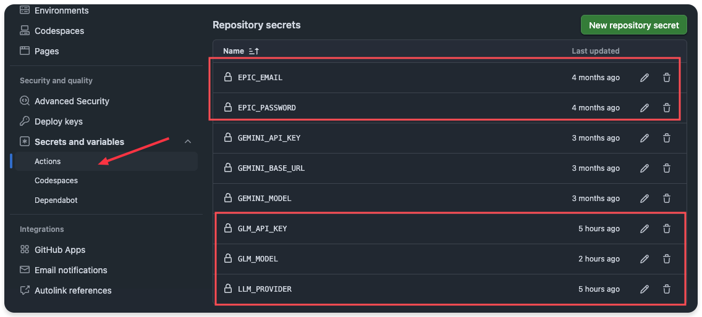

<div align="center">
  <h1>Epic Weekly Free Games Helper</h1>

  <p>
    <a href="https://github.com/Ronchy2000/epic-freebies-helper/actions/workflows/epic-gamer.yml"></a>
    <a href="https://www.python.org/"></a>
    <a href="LICENSE"></a>
    <a href="https://github.com/Ronchy2000/epic-freebies-helper/stargazers"></a>
    <a href="https://visitor-badge.laobi.icu/badge?page_id=Ronchy2000.epic-freebies-helper"></a>
  </p>
</div>

[中文文档](README.md) | [English](README.en.md)

## Branch Notice

This is the OpenAI / GPT testing branch.

This branch specifically supports using `LLM_PROVIDER=openai` to call image-capable GPT models for captcha handling.

Use the following test values:

| Setting | Recommended value |
| --- | --- |
| `LLM_PROVIDER` | `openai` |
| `OPENAI_BASE_URL` | `https://api.openai.com/v1` |
| `OPENAI_MODEL` | `gpt-4.1-mini` |

If you use a third-party OpenAI-compatible gateway, confirm that it supports the Chat Completions `image_url` input format.

This branch is not for DeepSeek V4 testing. Do not configure `DEEPSEEK_MODEL` on this branch.

To test DeepSeek V4, switch to the `codex/add-deepseekv4-provider` branch and set
`DEEPSEEK_MODEL` to `deepseek-v4-pro`.

## Project Description

This project runs an Epic weekly free-games claiming flow on GitHub Actions.

The default runtime is GitHub Actions. No server or long-running local machine is required.

The workflow includes:

| Feature | Description |
| --- | --- |
| Epic login | Signs in with the configured Epic email and password |
| Weekly free-game discovery | Reads the currently claimable Epic free games |
| Captcha handling | Uses the configured multimodal model for login or checkout captcha steps |
| Claim flow | Opens the product page and performs the claim action |
| Scheduled execution | Runs on the configured GitHub Actions schedule |

## Before You Start

Confirm these requirements before configuration:

| Item | Requirement |
| --- | --- |
| Epic account | An Epic account that can sign in normally |
| Epic 2FA | Email, SMS, and authenticator-based 2FA must be disabled |
| GitHub account | Required to fork the repository and run GitHub Actions |
| Model provider | At least one provider that supports image input |
| API key | Configure the API key for the selected provider |

## Risk Notice

> [!WARNING]
> This project automatically performs Epic login, captcha handling, and claim actions.
>
> Check whether this automation is allowed by the relevant platform terms before use.
>
> Account risk control, login errors, claim failures, API costs, and credential exposure are the user's responsibility.

## Quick Start

### 1. Fork the repository and enable Actions

> [!TIP]
> If you already forked this repository, open your fork on GitHub and click `Sync fork` -> `Update branch` before continuing.

1. Fork this repository to your GitHub account.
2. Open the `Actions` page in your fork.
3. Enable the workflow named `Epic Awesome Gamer (Scheduled)`.

### 2. Configure Secrets

Go to `Settings` -> `Secrets and variables` -> `Actions`, then add the following Secrets.

#### Required Secrets

| Secret | Description | Example |
| --- | --- | --- |
| `EPIC_EMAIL` | Epic login email | `your_email@example.com` |
| `EPIC_PASSWORD` | Epic login password | `your_password` |
| `LLM_PROVIDER` | Model provider. Options: `glm`, `openai`, `gemini` | `glm` |

#### Provider Configuration

Choose one provider group according to `LLM_PROVIDER`.

| Provider | Required Secret | Recommended value | Description |
| --- | --- | --- | --- |
| `glm` | `GLM_API_KEY` | - | Zhipu API key |
| `glm` | `GLM_BASE_URL` | `https://open.bigmodel.cn/api/paas/v4` | Zhipu OpenAI-compatible endpoint |
| `glm` | `GLM_MODEL` | `glm-4.6v` | Recommended default model |
| `openai` | `OPENAI_API_KEY` | - | OpenAI API key |
| `openai` | `OPENAI_BASE_URL` | `https://api.openai.com/v1` | OpenAI API endpoint |
| `openai` | `OPENAI_MODEL` | `gpt-4.1-mini` | Must support image input |
| `gemini` | `GEMINI_API_KEY` | - | Gemini or AiHubMix key |
| `gemini` | `GEMINI_BASE_URL` | `https://aihubmix.com` | Gemini-compatible endpoint |
| `gemini` | `GEMINI_MODEL` | `gemini-2.5-pro` | Recommended starting model |

`GEMINI_BASE_URL` is the endpoint variable. Do not write `GEMINI_BASE_MODEL`.

Configuration page examples:




#### Advanced Model Overrides

These settings are usually not required. Leave them empty to use the active provider default model.

| Secret | Description |
| --- | --- |
| `CHALLENGE_CLASSIFIER_MODEL` | Captcha type classification model |
| `IMAGE_CLASSIFIER_MODEL` | Image classification model |
| `SPATIAL_POINT_REASONER_MODEL` | Point-selection captcha reasoning model |
| `SPATIAL_PATH_REASONER_MODEL` | Drag-path captcha reasoning model |

Set these four variables only when different captcha steps need different models.

### 3. Run the workflow manually

1. Open the `Actions` page.
2. Select `Epic Awesome Gamer (Scheduled)`.
3. Click `Run workflow`.
4. Wait for the run to finish before checking the result.

> [!IMPORTANT]
> Epic risk-control behavior may trigger repeated retries during captcha or checkout.
> A single run may take 15 to 20 minutes. Do not cancel the workflow before it finishes.

### 4. Check the result

Successful runs usually contain log lines similar to:

```text
Login success
Right account validation success
Authentication completed
Starting free games collection process
All week-free games are already in the library
```

Example log:


## Common Configuration

| Setting | Recommended value | Description |
| --- | --- | --- |
| `LLM_PROVIDER` | `glm` | Options: `glm`, `openai`, `gemini` |
| `GLM_MODEL` | `glm-4.6v` | Recommended model for the GLM provider |
| `OPENAI_MODEL` | `gpt-4.1-mini` | Recommended model for the OpenAI provider. Must support image input |
| `GEMINI_MODEL` | `gemini-2.5-pro` | Recommended model for the Gemini provider |
| `ENABLE_APSCHEDULER` | `false` | GitHub Actions uses cron; keep this `false` for local one-shot runs |

See [Provider Configuration](docs/providers.md) for full provider details.

## Run Logs and Artifacts

Each GitHub Actions run attempts to upload these artifacts:

| Artifact | Content |
| --- | --- |
| `epic-logs-<run_id>` | Runtime logs |
| `epic-runtime-<run_id>` | `promotions.json`, `purchase_debug` screenshots, and debug text |
| `epic-screenshots-<run_id>` | Screenshots for login failures, risk-control pages, or auth pages |

Download location:

1. Open the specific Actions run page.
2. Scroll to the bottom.
3. Find `Artifacts`.
4. Download the zip files that are shown on the page.

See [Troubleshooting](docs/troubleshooting.md) for artifact details.

## FAQ

| Symptom | Description | Action |
| --- | --- | --- |
| `two_factor_authentication.required` | Epic 2FA is still enabled | Disable email, SMS, and authenticator 2FA, then rerun |
| Redirect to `/id/login/correction/privacy-policy` | The account requires privacy-policy confirmation | Sign in with a browser and complete the confirmation |
| `One more step` | Epic added a checkout verification step | Wait for the workflow to handle it |
| `Device not supported` | The product may officially support Windows only | Wait for the workflow to click `Continue` |
| Actions runs longer than 15 minutes | Captcha or checkout retries are in progress | Wait for the run to finish, then inspect logs and artifacts |
| Workflow succeeds but the game is not in the library | Checkout or final state confirmation may be incomplete | Download artifacts and open an issue |

See [Troubleshooting](docs/troubleshooting.md) for the full troubleshooting guide.

## More Documentation

| Document | Content |
| --- | --- |
| [Provider Configuration](docs/providers.md) | GLM, OpenAI / GPT, and Gemini / AiHubMix configuration |
| [Troubleshooting](docs/troubleshooting.md) | Logs, artifacts, common issues, and issue information |
| [Local Debugging and Docker](docs/local-debug.md) | Local one-shot run and Docker runtime |
| [Advanced Guide](docs/advanced.en.md) | Project structure, adapter details, and maintenance notes |
| [Maintenance Log](docs/maintenance-log.md) | Historical maintenance records |

## Project Origins and References

This project is based on `QIN2DIM/epic-awesome-gamer` and references `10000ge10000/epic-kiosk`:

| Project | Description |
| --- | --- |
| [QIN2DIM/epic-awesome-gamer](https://github.com/QIN2DIM/epic-awesome-gamer) | Original project and source of the core automation flow |
| [10000ge10000/epic-kiosk](https://github.com/10000ge10000/epic-kiosk) | Reference for GitHub Actions packaging and documentation layout |
| [LINUX DO](https://linux.do/t/topic/2036835/4) | Community discussion and feedback entry |

## Disclaimer

- This project is for learning and research around automation flows.
- Automated actions may violate the target platform's terms of service. Evaluate the risk yourself.
- You are responsible for any consequences caused by using this project.

## Star History

<a href="https://www.star-history.com/?type=date&repos=ronchy2000%2Fepic-freebies-helper">
  <picture>
    <source
      media="(prefers-color-scheme: dark)"
      srcset="https://api.star-history.com/chart?repos=ronchy2000/epic-freebies-helper&type=date&theme=dark&legend=top-left"
    />
    <source
      media="(prefers-color-scheme: light)"
      srcset="https://api.star-history.com/chart?repos=ronchy2000/epic-freebies-helper&type=date&legend=top-left"
    />
    
  </picture>
</a>


## Community Thanks

The continuous improvement of this project relies not only on code iterations, but heavily on every user who, upon encountering an error, chose not to give up, but patiently submitted a complete error report.

The resolution of many edge cases did not stem from unilateral developer testing, but was built upon the detailed logs, screenshots, and reproduction steps actively provided by the community. It is this authentic diagnostic data that enabled obscure and hidden issues to be accurately isolated and resolved.

We extend our most genuine gratitude to everyone who has submitted feedback. The time you invested and the real-world data you shared have steadily illuminated the blind spots in development, allowing this project to mature and genuinely benefit a wider audience.

<div align="center">
  <sub>Thank you to everyone who opened issues, uploaded artifacts, and shared real failure cases.</sub>
</div>

<p align="center">
  <a href="https://github.com/AaronL725"></a>
  <a href="https://github.com/cita-777"></a>
  <a href="https://github.com/1208nn"></a>
  <a href="https://github.com/LGDhuanghe"></a>
  <a href="https://github.com/AdjieC"></a>
</p>

<!-- <p align="center">
  <sub>
    <a href="https://github.com/AaronL725"><b>AaronL725</b></a> ·
    <a href="https://github.com/cita-777"><b>cita-777</b></a> ·
    <a href="https://github.com/1208nn"><b>1208nn</b></a> ·
    <a href="https://github.com/LGDhuanghe"><b>LGDhuanghe</b></a> ·
    <a href="https://github.com/AdjieC"><b>AdjieC</b></a>
  </sub>
</p> -->

<!--
Avatar wall template:

<p align="center">
  <a href="https://github.com/<username-1>">.png?size=96" width="64" height="64" alt="@<username-1>" /></a>
  <a href="https://github.com/<username-2>">.png?size=96" width="64" height="64" alt="@<username-2>" /></a>
  <a href="https://github.com/<username-3>">.png?size=96" width="64" height="64" alt="@<username-3>" /></a>
</p>

<p align="center">
  <sub>
    <a href="https://github.com/<username-1>"><b><username-1></b></a> ·
    <a href="https://github.com/<username-2>"><b><username-2></b></a> ·
    <a href="https://github.com/<username-3>"><b><username-3></b></a>
  </sub>
</p>
-->
