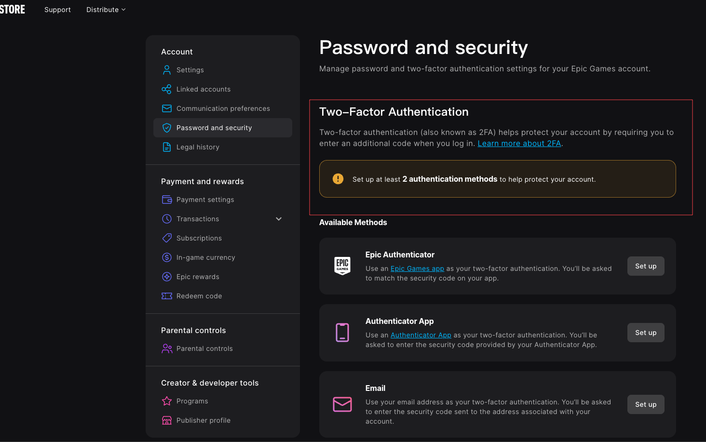
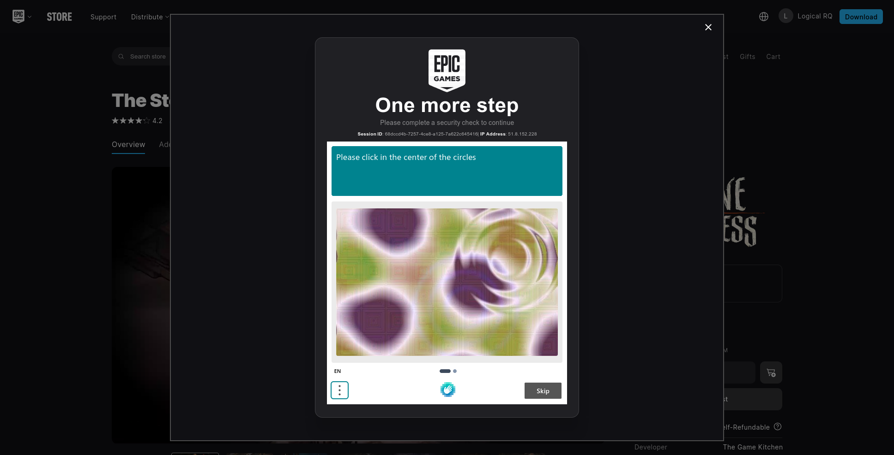

# 排障说明

本文说明 GitHub Actions 日志、Artifact、常见失败阶段和提交 Issue 前需要准备的信息。

## 查看 GitHub Actions 日志

1. 打开 Fork 后仓库的 `Actions` 页面。
2. 进入本次运行记录。
3. 展开 `Run Epic Awesome Gamer` 步骤。
4. 查看登录、验证码、商品页和 checkout 相关日志。

不要只根据单行报错判断结果。验证码和 checkout 阶段可能出现多轮重试。

## 下载 Artifact

1. 打开本次 Actions 运行页面。
2. 拉到页面底部。
3. 找到 `Artifacts`。
4. 下载页面中实际出现的 zip 文件。

## Artifact 类型

| Artifact | 内容 | 出现条件 |
| --- | --- | --- |
| `epic-logs-<run_id>` | 运行日志 | 通常每次运行都会上传 |
| `epic-runtime-<run_id>` | `promotions.json`、`purchase_debug` 截图和文本 | 进入商品页或 checkout 阶段后常见 |
| `epic-screenshots-<run_id>` | 登录失败、风控页、授权页截图 | 登录或授权阶段保存过截图时出现 |

GitHub Actions 只显示实际上传成功且包含文件的 Artifact。不同运行记录中显示的 Artifact 可能不同。

## 常见问题索引

| 日志或现象 | 阶段 | 可能原因 | 处理方式 |
| --- | --- | --- | --- |
| `two_factor_authentication.required` | 登录 | Epic 账号仍启用 2FA | 关闭邮箱、短信、验证器二步验证后重新运行 |
| 页面跳转到 `/id/login/mfa` | 登录 | Epic 要求二步验证 | 关闭 Epic 2FA |
| `privacy-policy correction` | 登录后跳转 | 账号需要确认隐私政策 | 使用浏览器手动登录 Epic 并完成确认 |
| `One more step` | 结账 | Epic 结账阶段追加人机校验 | 等待脚本处理，不要立即取消 |
| `Device not supported` | 商品页或结账 | 商品仅支持 Windows | 等待脚本点击 `Continue` |
| Actions 运行 15 分钟以上 | 验证码或结账 | 多轮重试 | 等待运行结束后查看日志 |
| 工作流成功但游戏未入库 | 结账 | 状态识别或 checkout 未完成 | 下载 Artifact 并提交 Issue |

## 登录阶段问题

### Epic 2FA 未关闭

典型信号：

- `errors.com.epicgames.common.two_factor_authentication.required`
- `Two-Factor authentication required to process request`
- 页面跳转到 `/id/login/mfa`

处理方式：

1. 使用正常浏览器登录 Epic 账号。
2. 进入账号安全设置页面。
3. 移除邮箱、短信、验证器等全部二步验证方式。
4. 重新运行 GitHub Actions。

参考界面：

### 隐私政策确认页

典型信号：

- 日志包含 `privacy-policy correction`
- 登录后 URL 类似 `/id/login/correction/privacy-policy`

处理方式：

1. 使用正常浏览器登录 Epic。
2. 手动完成隐私政策确认。
3. 重新运行 GitHub Actions。

## 验证码阶段问题

验证码阶段可能发生多次失败和重试。

处理方式：

1. 等待工作流自然结束。
2. 下载 `epic-logs-<run_id>`。
3. 如果存在 `epic-runtime-<run_id>`，检查 `purchase_debug/` 中的截图和文本。
4. 如果需要提交 Issue，附上完整 Artifact zip。

不要在运行几分钟后因为看到重试日志就手动取消工作流。

## 结账阶段问题

### `One more step`

`One more step` 是 Epic 结账阶段追加的人机校验。

处理方式：

1. 等待脚本继续处理。
2. 如果最终失败，下载 Artifact。
3. 提交 Issue 时提供 checkout 阶段日志和 `purchase_debug`。

参考界面：

### `Device not supported`

该提示通常出现在商品仅支持 Windows，而 GitHub Actions 运行环境是 Linux 的时候。

处理方式：

1. 等待脚本点击弹窗里的 `Continue`。
2. 如果流程停在商品页或 checkout，下载 Artifact。
3. 提交 Issue 时提供运行链接和 Artifact。

## Provider 接口问题

| 日志或现象 | 可能原因 | 处理方式 |
| --- | --- | --- |
| HTTP 401 / 403 | API Key 无效或权限不足 | 检查当前 provider 的 API Key |
| HTTP 429 | 额度、频率或模型繁忙 | 更换模型或稍后重试 |
| `model not found` | 模型名和 provider 不匹配 | 检查模型变量是否跟随当前 provider |
| `unsupported image` | 模型或网关不支持图片输入 | 更换支持图片输入的模型或接口 |
| 结构化解析失败 | 模型输出不符合预期格式 | 上传完整日志和 Artifact 以便定位 |

## 提交 Issue 前需要准备的信息

提交 Issue 时请提供：

- 本次 GitHub Actions 运行链接。
- 使用的 provider：`glm` / `deepseek` / `openai` / `gemini`。
- 失败阶段：登录 / 验证码 / 商品页 / checkout / 其他。
- 相关日志片段。
- 本次运行生成的 Artifact zip。

如果 fork 是私有仓库，需要上传实际 Artifact。维护者无法访问私有仓库的 Actions 页面。

如果 fork 是公开仓库，通常可以提供 Actions 运行链接，但仍建议上传 Artifact zip。
